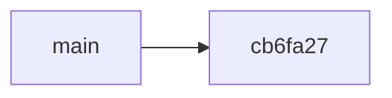

# git

- Version control system
  - From the idea similar to Subversion (SVN), CVS, Team Foundation Server (TFS), Visual Source Safe, …
  - However, it's conceptually different from all of these
- Linus Torvalds
  - Developed git for managing the Linux kernel

- Centralized version control system
  - Works only online, no offline support
  - It's slow
  - Single point of failure
  - …

- Distributed version control system
  - There is no server, more like a P2P network
  - Works great when offline, because all actions are first and foremost local
  - It's super fast
  - There is no single point of failure
  - …

## Git commands

```shell
# Initialize a new repository
$ git init

# Get an overview of the repository and working directory status
$ git status

# Send something from the working directory to the staging area
$ git add <file>
```

## A graphical representation of the repository

### Submitting changes to the repository


### State of the repository


