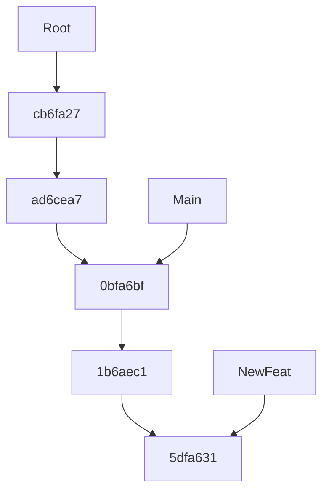
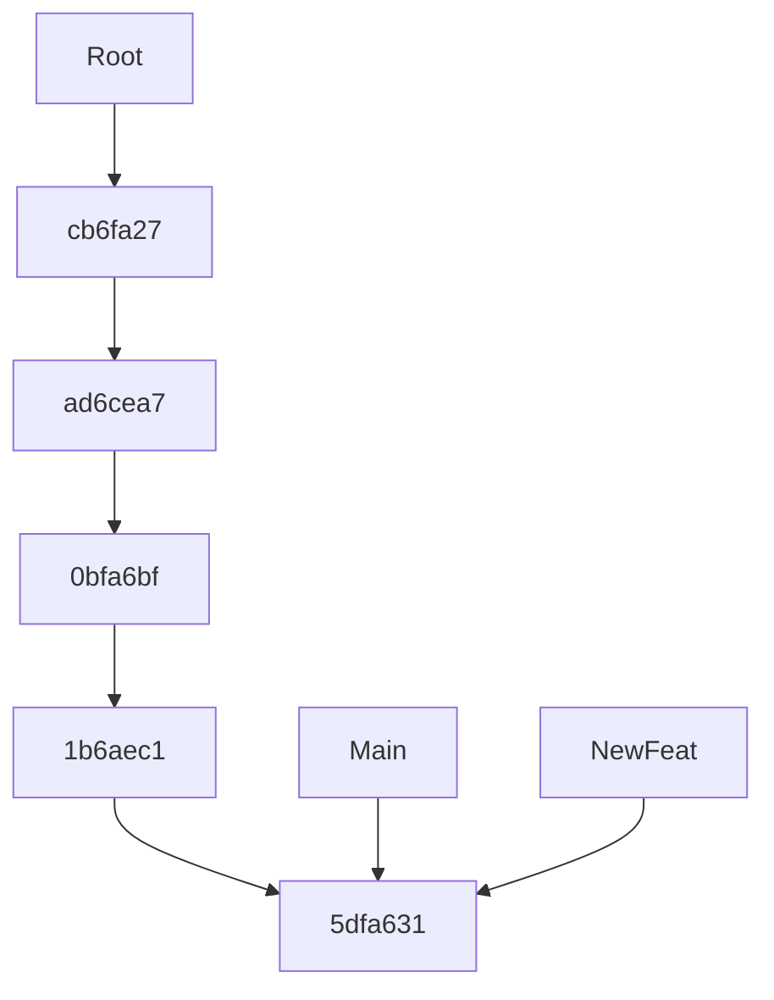

# git

- Version control system
  - From the idea similar to Subversion (SVN), CVS, Team Foundation Server (TFS), Visual Source Safe, …
  - However, it's conceptually different from all of these
- Linus Torvalds
  - Developed git for managing the Linux kernel

- Centralized version control system
  - Works only online, no offline support
  - It's slow
  - Single point of failure
  - …

- Distributed version control system
  - There is no server, more like a P2P network
  - Works great when offline, because all actions are first and foremost local
  - It's super fast
  - There is no single point of failure
  - …

## Git commands

```shell
# Configure user name, email, …
$ git config [--global] user.name "Golo Roden"
$ git config [--global] user.email "golo.roden@thenativeweb.io"
$ git config [--global] core.editor "notepad"

# Initialize a new repository
$ git init

# Get an overview of the repository and working directory status
$ git status

# Send something from the working directory to the staging area
$ git add <file>

# Send *all* the changes from the working directory and its subdirectories to the staging area
$ git add .

# If you want to select which lines to add (yes, no, quit, all from here, none from here, edit, help)
$ git add --patch <file>

# Move the information that a file was deleted to the staging area
$ git rm <file>

# Commit changes from the staging area to the repository
$ git commit

# Commit changes from the staging area to the repository and set a message
$ git commit -m "<message>"

# Fix the commit message of your last commit
$ git commit -m "<message>" --amend

# Show changes in a file in the working directory, unless it has already been staged
$ git diff <file>

# Show changes in a file in the working directory, if it has already been staged
$ git diff --cached <file>

# Show the history of what has happened
$ git log

# Remove an already staged file from the staging area without losing the changes to it.
$ git restore --staged <file>

# Discard any changes in the working directory
$ git restore <file>

# Show all branches
$ git branch

# Create a new branch, but do not switch to it
$ git branch <name>

# Create a new branch, and switch to it
$ git checkout -b <name>

# Switch a branch
$ git checkout <name>

# Delete a branch (which has already been merged)
$ git branch -d <name>

# Delete a branch (even if it has not yet been merged), losing data
$ git branch -D <name>

# Merging a branch (you have to be in the target branch)
$ git merge <sourcebranch>
```

## A graphical representation of the repository

### Submitting changes to the repository


### How a fast-forward merge works

Given that a `NewFeat` branch was created and diverged from `main`:



All we need to do is update the `main` reference:


